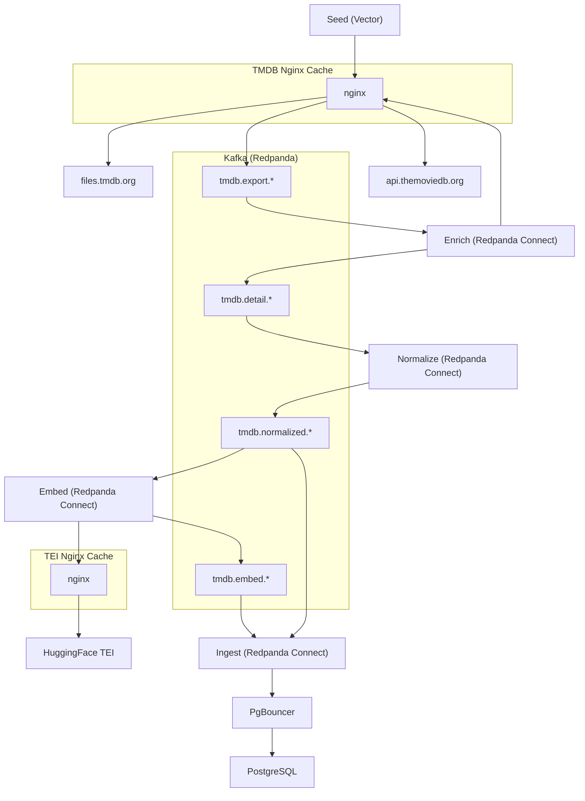

# The Movie Pipeline

A Kafka-powered data pipeline that ingests [The Movie Database](https://www.themoviedb.org) daily exports, enriches them via the TMDB API, normalizes nested structures, optionally generates text embeddings, and loads everything into a PostgreSQL database with vector support.

## Quick Start

1. Get your API Read Access Token from [TMDB Profile](https://www.themoviedb.org/settings/api)

2. Copy environment variables: `.env.example` → `.env`

   ```bash
   cp .env.example .env
   ```

3. Set [`TMDB_API_SECRET`](.env.example#L125) in `.env` to your TMDB API Read Access Token

4. Start Docker services

   ```bash
   docker compose up -d
   ```

5. Open the Grafana dashboard at [grafana.127-0-0-1.sslip.io:8000](http://grafana.127-0-0-1.sslip.io:8000/d/tmdb-pipeline-v1/tmdb-pipeline)

## Architecture



**Observability:** Prometheus, Grafana, Loki, and Vector collect metrics and logs across all services.

## Prerequisites

- Docker & Docker Compose
- (Optional) [Task](https://taskfile.dev) — run `task --list` for commands
- (Optional) [teyfix/traefik](https://github.com/teyfix/traefik) — for TLS termination and automatic routing

## Accessing Services

### With Traefik (Recommended)

If you run [teyfix/traefik](https://github.com/teyfix/traefik) alongside this project, services are exposed with automatic TLS:

- Grafana: `https://grafana.tmdb.127-0-0-1.sslip.io`
- Prometheus: `https://prometheus.tmdb.127-0-0-1.sslip.io`
- Kafka UI: `https://kafka-ui.tmdb.127-0-0-1.sslip.io`
- pgAdmin: `https://pgadmin.tmdb.127-0-0-1.sslip.io`
- TEI: `https://tei.tmdb.127-0-0-1.sslip.io`
- TMDB API Proxy: `https://api.tmdb.127-0-0-1.sslip.io`
- TMDB Files Proxy: `https://files.tmdb.127-0-0-1.sslip.io`

### Without Traefik

Use the internal nginx reverse proxy on port `8000`:

- Grafana: `http://grafana.127-0-0-1.sslip.io:8000`
- Prometheus: `http://prometheus.127-0-0-1.sslip.io:8000`
- Kafka UI: `http://kafka-ui.127-0-0-1.sslip.io:8000`
- pgAdmin: `http://pgadmin.127-0-0-1.sslip.io:8000`
- TEI: `http://tei.127-0-0-1.sslip.io:8000`
- TMDB API Proxy: `http://tmdb-api.127-0-0-1.sslip.io:8000`
- TMDB Files Proxy: `http://tmdb-files.127-0-0-1.sslip.io:8000`

**Note:** TCP services (Kafka, PostgreSQL) require Traefik for TLS termination and cannot be exposed through the port-8000 HTTP proxy.

## Core Services

| Service            | Role                                                  | Compose Profile |
| ------------------ | ----------------------------------------------------- | --------------- |
| `seed`             | Downloads TMDB daily exports and publishes to Kafka   | —               |
| `enrich`           | Fetches full TMDB API documents from export IDs       | —               |
| `normalize`        | Flattens and sanitizes API responses                  | —               |
| `ingest`           | Loads data into PostgreSQL via Bloblang mappings      | —               |
| `embed`            | Generates text embeddings via TEI                     | `embed`         |
| `sample`           | Generates JSON/TypeScript samples from Kafka topics   | `sample`        |
| `redpanda`         | Kafka-compatible broker                               | —               |
| `kafka-ui`         | Web UI for browsing Kafka topics                      | —               |
| `redpanda-console` | Alternative Kafka web UI                              | `console`       |
| `postgres`         | Primary database (Supabase image)                     | —               |
| `pgbouncer`        | Transaction-level connection pooler                   | —               |
| `pgadmin`          | Database management UI                                | —               |
| `tmdb`             | Caching proxy for TMDB API and file exports           | —               |
| `tei`              | Caching proxy for the embedding inference server      | —               |
| `metrics`          | Prometheus, Grafana, Loki, Vector observability stack | —               |
| `nginx`            | Internal HTTP reverse proxy (port 8000)               | —               |
| `migrate`          | Drizzle ORM migration runner                          | —               |

## Data Flow

1. **Export** — `seed` downloads daily ID files (`movie_ids_MM_DD_YYYY.json.gz`, etc.) from `files.tmdb.org` and publishes IDs to `tmdb.export.*`.
2. **Enrich** — `enrich` consumes IDs, calls the TMDB API through the internal cache (`tmdb.lokal`), and writes full JSON documents to `tmdb.detail.*`.
3. **Normalize** — `normalize` unwraps nested structures (`results`, `author_details`, `release_dates`), replaces empty strings with `null`, and writes to `tmdb.normalized.*`.
4. **Embed** _(optional)_ — `embed` builds text inputs from movies and calls the TEI service to produce embeddings on `tmdb.embed.*`.
5. **Ingest** — `ingest` maps normalized (and embedded) messages to PostgreSQL tables using Bloblang, deduplicates by `version_ts`, and performs upserts via PgBouncer.

## Taskfile Commands

Common tasks are defined in `taskfile.yaml`:

```bash
task migrate              # Generate and apply DB migrations
task up -- <service>      # Start specific services
task kcat -- <topic>      # Consume Kafka topic from beginning
task rpk -- topic list    # List Kafka topics
task logs -- <service>    # Stream Docker logs
task sample count=100     # Generate TypeScript samples
```

## Configuration

All environment variables are documented in `.example.env`. Key groups include:

- **App:** `APP_NAME`, `APP_SECRET`
- **Traefik:** `TRAEFIK_SERVICE_PREFIX`, `TRAEFIK_BASE_DOMAIN`, `TRAEFIK_ACME_RESOLVER`
- **Kafka:** `KAFKA_NUM_PARTITIONS`, `KAFKA_MAX_MESSAGE_BYTES`, `KAFKA_CLEANUP_POLICY`
- **Postgres:** `POSTGRES_DB`, `POSTGRES_USER`, `POSTGRES_PASSWORD`, `PG_USER`, `PG_PASSWORD`
- **Pipeline:** `KAFKA_BROKERS`, `POSTGRES_URL`, `TMDB_API_KEY`, `TMDB_API_SECRET`
- **Resources:** CPU/memory limits for Redpanda, Postgres, Normalize, Ingest

## Optional Profiles

Some services are heavy or diagnostic and are gated behind Docker Compose profiles:

- **`--profile embed`** — Starts the embedding worker (GPU recommended).
- **`--profile sample`** — Starts the sample/type generator.
- **`--profile console`** — Starts Redpanda Console (alternative to Kafka UI).

## Development Tooling

- `prettier.config.mjs` — Prettier configuration for SQL, YAML, JSON, and shell scripts.
- `package.json` — Root dev dependencies (prettier plugins, quicktype).
- `.vscode/settings.json` — Pre-configured PostgreSQL/PgBouncer SQLTools connections.
